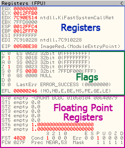
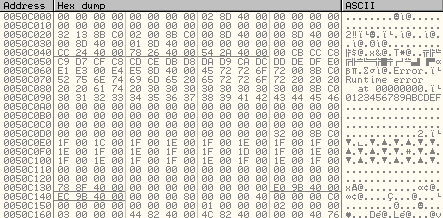
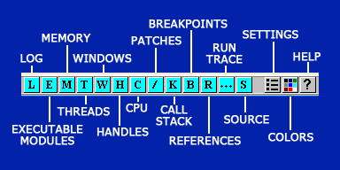
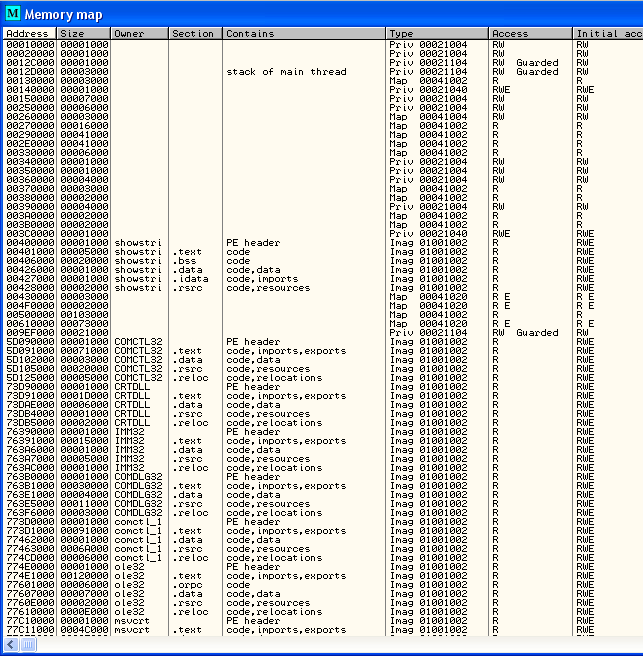
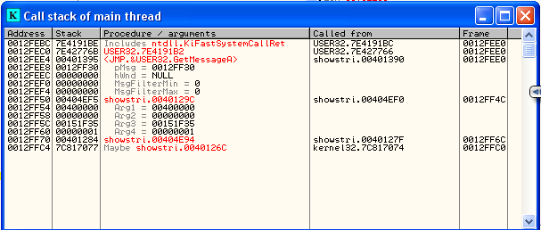
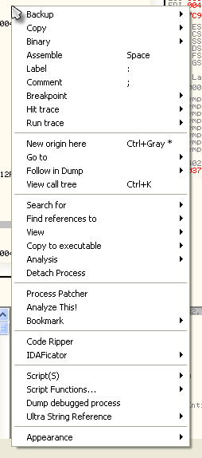

Tutorial #2 : Intro To Olly Debug
=================================

Link: http://thelegendofrandom.com/blog/archives/31

### What is Olly Debugger?

From the author, Oleh Yuschuk, “OllyDbg is a 32-bit assembler level analysing debugger for Microsoft® Windows®. Emphasis on binary code analysis makes it particularly useful in cases where source is unavailable. ” Olly is also a “dynamic” debugger, meaning it allows the user to change quite a few things as the program is running. This is very important when experimenting with a binary, trying to figure out how it works. Olly has many, many great features, and that is why it is probably the number one debugger used for reverse engineering (at least in ring 3, but we’ll get to that later.)

### An Overview

Here is a picture of Olly’s main display, along with some labels:

Olly opens with the default window, CPU, open. This is where most of the “big-picture” data is. If you ever close this window, just click the “C” icon in the toolbar. It is separated into 4 main fields; Disassembly, Registers, Stack, and Dump. Here is a description of each section.

##### 1. Disassembly

This window contains the main disassembly of the code for the binary. This is where Olly displays information in the binary, including the opcodes and translated assembly language. The first column is the address (in memory) of the instruction. The second column is what’s called the opcodes- in assembly language, every instruction has at least one code associated with it (many have multiple). This is the code that the CPU really wants and the only code it can read. These opcodes make up ‘machine language’, the language of the computer. If you were to view the raw data in a binary (using a hex editor) you would see a string of these opcodes, and nothing more. One of Olly’s main jobs is to ‘disassemble’ this ‘machine language’ into more human readable assembly language. The third column is this assembly language. Granted, to someone who does not know assembly, it doesn’t look much better than the opcodes, but as you learn more, the assembly offers FAR more insight into what the code is doing.

The last column is Olly’s comments on that line of code. Sometimes this contains the names of API calls (if Olly can figure them out) such as CreateWindow and GetDlgItemX. Olly also tries to  help us understand the code by naming any calls that are not part of the API with helpful names, in the case of this picture, “ImageRed.00510C84″ and “ImageRed.00510BF4″. Granted, these are not that helpful, but Olly also allows us to change them into more meaningful names. You may also put your own comments in this column; just double-click on the line in this column and a box pops up allowing you to enter your comment. These comments will then be saved for next time automatically.

##### 2. Registers

Every CPU has in it a collection of registers. These are temporary holders for values, much like a variable in any high-level programming language. Here is a more detailed (and labeled) view of the registers window:

On the top is the actual CPU Registers. The registers will change color if they have been changed from black to red (makes it really easy to watch for changes). You can also double click on any of the registers to change their contents. These registers are used for many things, and we will have much to say about them later.

The middle section are flags, used by the CPU to flag the code that something has happened (two numbers are equal, one number is greater than another, etc). Double clicking one of the flags changes it. These will also play an important part in our journey.

The bottom section are the FPU, or Floating Point Unit registers. These are used whenever the CPU performs any arithmetic involving decimal points. These are rarely used by reversers, mostly when we get into encryption.

##### 3. The Stack

The stack is a section of memory reserved for the binary as a ‘temporary’ list of data. This data includes pointers to addresses in memory, strings, markers, and most importantly, return addresses for the code to return to when calling a function. When a method in a program calls another method, control needs to be shifted to this new method so that it can retun. The CPU must keep track of where this new method was called from so that when this new method is done, the CPU can return to where it was called and continue executing the code after the call. The stack is where the CPU will hold this return address.

One thing to know about the stack is that it is a a “First In, Last Out” data structure. The metaphor normally used is one of those stacks of plates in a cafeteria that are spring loaded. When you ‘push’ a plate onto the top, all of the plates underneath are pushed down. When you remove (‘pop’) a plate off the top, all of the plates that were underneath raise up one level. We will see this in action in the next tutorial, so don’t worry if it’s a little hazy.

In this picture, the first column is the address of each data member, the second column is the hex, 32-bit representation of the data, and the last column is Olly’s comments about this data item, if it can figure them out. If you notice the first row, you will see a “RETURN to kernel…” comment. This is an address that the CPU has placed on the stack for when the current function is done, so that it will know where to return to.

In Olly, you can right click on the stack and choose ‘modify’ to change the contents.

##### 4 The Dump

Earlier in this tutorial, when we talked about the raw ‘opcodes’ that the CPU reads inside a binary, I mentioned that you could see this raw data in a hex viewer. Well, in Olly, you don’t have to. The dump window is a built-in hex viewer that lets you see the raw binary data, only in memory as opposed to on disk. Usually it shows two views of the same data; hexadecimal and ASCII. These are represented in the two right-hand columns in the previous picture (the first column is the address in memory that the data resides.) Olly does allow these representations of data to be changed, and we will see this later in the tutorials.

### The Toolbar

Unfortunately, the Olly toolbar leaves a little much to be desired (especially as English is not the author’s first tongue.) I have labeled the left hand toolbar icons to help:

These are your main controls to run code. Keep in mind that, especially as you start using Olly, all of these buttons are also accessible from the “Debug” drop down menu, so if you don’t know what something is, you can look in there.

I will make a couple of remarks about some of the icons. “Re-load” is basically to restart the app and pause it at the entry point. All patches (see later) will be removed, some breakpoints will be disabled, and the app will not have run any code yet, well, most of the time anyway. “Run” and “Pause” do just that. “Step In” means run one line of code and then pause again, calling into a function call if there was one. “Step Over” does the same thing, but jumps over a call to another function. “Animate” is just like Step In and Over except it does it slowly enough that you can watch it. You won’t use this much, but sometimes it’s fun to watch code run, especially if it’s a polymorphic binary and you can watch the code change. But I’m getting ahead of myself…

Next is the (even more cryptic) windows icons:

Each of these icons opens a window, some of which you will use often, some rarely. Seeing as they are not the most intuitive letters, you can also do like I did and just start clicking them all until you find what you want. Each of these are also accessible in the “View” menu, so you can get some help when first starting out.I will go over some of the more common windows right now:

##### 1. (M)emory

The memory window displays all of the memory blocks that the program has allocated. It includes the main sections of the running app (in this case, the “Showstr ” items in the Owner column. You can also see a lot of other sections down the list; these are DLL’s that the program has loaded into memory and plans on using. If you double-click on any of these lines, a window will open showing a disassembly (or hex dump) of that section. This window also shows the type of block, the access rights, the size and the memory address where the section is loaded.

##### 2. (P)atches

This window displays any “patches” you have made, ie. any changes to the original code. Notice that the state is set as Active; if you re-load the app (by clicking the re-load icon) these patches will become disabled. In order to re-enable them (or disable them) simply click on the desired patch and hit the spacebar. This toggles the patch on/off. Also notice that in the “Old” and “New” columns it shows the original instructions as well as the changed instructions.

##### 3. (B)reakpoints

This window shows where all of the current breakpoints are set. This window will be your friend

##### 3. (K)all Stack

(Gee, I wonder why beginners have a hard time remembering these icons…)

This window is different from the “Stack” see earlier. It shows a lot more info about calls being made in the code, the values sent to those functions, and more. We will see more of this shortly.

* In the next tutorial I will be including my version of Olly with many ‘upgrades’, some of which are buttons that you can actually understand. Here, you can see a picture of it *

### The Context Menu

For the last item of this tutorial, I wanted to quickly introduce you to the right-click menu in Olly. It is where a lot of action happens, so you should at least be familiar with it. Right-clicking anywhere in the disassembly section brings it up:

“Binary” allows editing of the binary data on a byte-by-byte level. This is where you may change a “Unregistered” string buried in a binary to “Registered” . “Breakpoint” allows you to set a breakpoint. There are several types of breakpoints and we will be going over them in the next tutorial. “Search For” is a rather large sub-menu, and it’s where you search the binary for data such as strings, function calls etc. “Analysis” forces Olly to re-analyze the section of code you are currently viewing. Sometimes Olly gets confused as to whether you are viewing code or data (remember, they’re both just numbers) so this forces Olly to consider where you are in the code and attempt to guess what this section should look like.

Also notice that my menu will look different from yours in that I have some plugins installed and they add some functionality. Don’t worry, we will be going over all of these in future tuts.

-Well, till next time.

R4ndom
